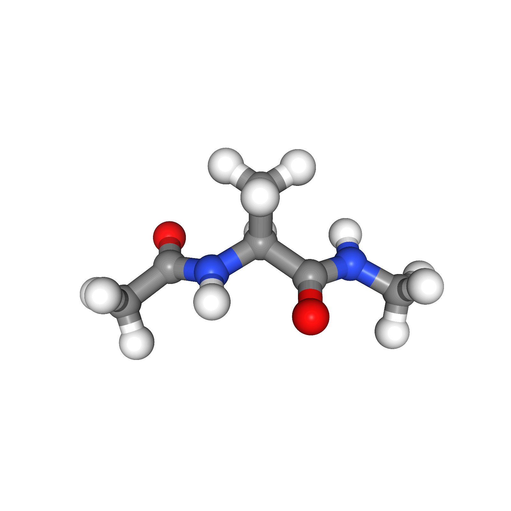

# GFlowNet for Transition Path Sampling

The goal of this project is to solve Transition Path Sampling (TPS) using GFlowNet.

## Installation

1. First, create a new Conda environment:
    ```
    conda create -n tps_gflow python=3.9
    ```

2. Activate the newly created environment:
    ```
    conda activate tps_gflow
    ```

3. Install the required packages using the following commands:
    ```
    conda install -c conda-forge openmmtools
    pip install tqdm wandb mdtraj matplotlib
    ```

## Usage

- **Training**: Run the following command to start training:
    ```
    bash scripts/train.sh
    ```

- **Evaluation**: Run the following command to perform evaluation:
    ```
    bash scripts/eval.sh
    ```

## Results

